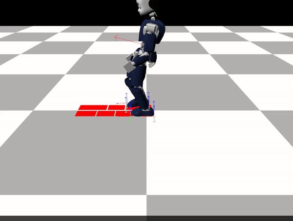

# Humanoid-Static-WBC
Humanoid walking with whole body control involves the coordinated management of all joints and limbs to achieve a stable walking motion.
* Footstep generation
* Center of Mass(CoM) trajectory Planning
* Foot trajectory planning
* Quadratic Programming (QP) Controller to track the above trajectories.
* Finite State Machine (FSM) to coordinate between the different states of
the movement.

## Finite State Machine

The FSM for a humanoid walking algorithm is one of the most important aspects. I will be using something similar to this:

1. DSP is a double support phase where both feet stay on the ground. For me
this will be shifting the CoM to the opposite side of the next step’s side.

2. SSP is the single support phase where we must lift the respective leg and
move it to the next footstep position , retaining the robot’s balance in the
process.

    

## Cubic Hermite Splines Trajectories
Cubic Hermite splines are a type of spline where each piece is a third-degree
polynomial specified in Hermite form. The spline ensures continuity of both the
function and its first derivative.

## CoM Trajectory
On SSP, as we see below, we have to move the CoM towards the landing
stop of the opposite foot.

On DSP the CoM has to remain on the offset point and wait for the next
step.

    

## Foot Trajectory

The foot has to move only on SSP. The starting point will be the current position
of the foot calculated by the forward Kinematics and the desired position will
be the next footsteps placement. However, we need to add one more point, in
order to lift the foot of the ground. For more details see the full report.

    
    

## Friction Cones
To ensure there is no slip I will be using friction cone constrains for the contact points 

    

# Results 

The result is as below:

And the measured trajectories for the CoM and Legs:

    

    

    

We see that for the most part the trajectories are identical to the desired.
The CoM swings around the y axis and has almost constant z-axis value.
The legs’ x-axis has step increments like expected the y axis is pretty much
constant and the z value has some spikes which are the lift phases.